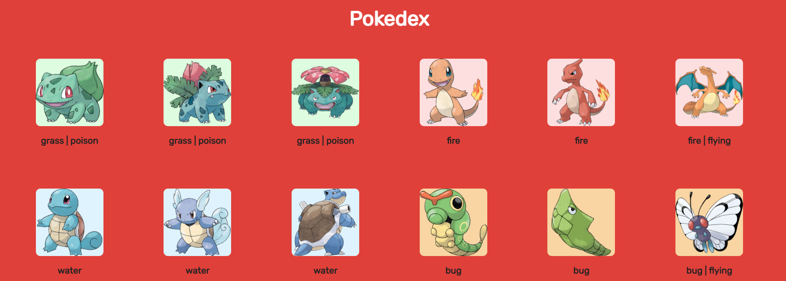

<h1 align="center">PokeDex</h1>



<h2> 🖥 Projeto:</h2>
<p>Pokedex com todas as infos dos pokemons consumindo a PokeApi e PokeEres a fim de estudo.</p>

<h2> ⚙ Tecnologias:</h2>
<p>- HTML5 <br>
  - CSS3 <br>
  - JavaScript
  </p>

<h2> 💻 Como acessar:</h2>

```md
Clone o repositório: 
htps://github.com/ramonxm/my-pokedex.git 
e acesse utilizando a extensão Live Server.
```

<br>

Desenvolvido por [Ramon Xavier](github.com/ramonxm) 👓
